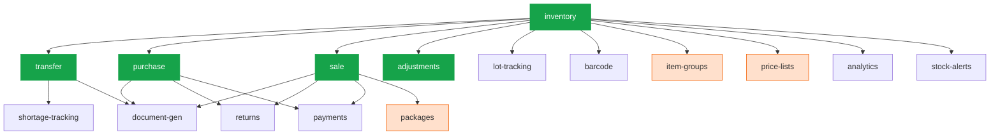

# WareOS v2 — Final Blueprint (Part 2 of 3)

## Modules · Frontend Architecture · Background Jobs · Offline PWA

**Companion docs:**
- [Part 1 — Architecture, Multi-Tenancy, Auth, Database](./wareos_v2_final_part1.md)
- [Part 3 — Testing, DevOps, Security, Scalability, Roadmap](./wareos_v2_final_part3.md)
- [Design System Reference](./design_reference.html)

**Last updated:** 2026-03-12

---

## 9. Module Registry (Plug-and-Play)

### Module Manifest Interface

Each module exports a typed manifest. The sidebar, API guards, and event bus all read from this registry.

```typescript
// core/modules/registry.ts
export interface ModuleManifest {
  id: string;                      // kebab-case: "item-groups"
  name: string;                    // "Item Groups"
  description: string;
  version: string;                 // semver: "1.0.0"
  icon: string;                    // Lucide icon name
  dependencies: string[];          // ["inventory"]
  permissions: Permission[];       // Permissions this module introduces
  routes: {
    path: string;                  // Relative to /t/{slug}/
    label: string;
    icon: string;
    permission?: Permission;
    group: 'inventory' | 'orders' | 'warehouse' | 'settings' | 'reports';
  }[];
  events?: {                       // Events this module emits
    name: string;
    payload: ZodSchema;
  }[];
  hooks?: {                        // Events this module listens to
    event: string;
    handler: string;               // Path to handler function
  }[];
}
```

### 20 Modules — Build Phase Clearly Marked

> [!IMPORTANT]
> **Phase 1 MVP builds 6 modules.** The remaining 14 are architecturally supported by the module registry and can be added incrementally. Claude Code should only build Phase 1 modules initially.

| # | Module | Deps | Build Phase | Key Tables |
|---|---|---|---|---|
| 1 | `inventory` | — | **Phase 1 MVP** | items, locations, units, contacts |
| 2 | `transfer` | inventory | **Phase 1 MVP** | transfers, transfer_items |
| 3 | `purchase` | inventory | **Phase 1 MVP** | purchases, purchase_items |
| 4 | `sale` | inventory | **Phase 1 MVP** | sales, sale_items |
| 5 | `adjustments` | inventory | **Phase 1 MVP** | adjustments, adjustment_items |
| 6 | `user-management` | — | **Phase 1 MVP** | user_profiles, user_locations |
| 7 | `audit-trail` | — | Phase 1 (lite) | audit_log |
| 8 | `stock-alerts` | inventory | Phase 1 (lite) | alert_thresholds |
| 9 | `analytics` | inventory | Phase 1 (lite) | (views only — basic KPIs) |
| 10 | `shortage-tracking` | transfer | Phase 1 (lite) | (computed columns on transfer_items) |
| 11 | `payments` | purchase, sale | Phase 1 (lite) | payments |
| 12 | `document-gen` | transfer, sale, purchase | Phase 2 | (PDF generation) |
| 13 | `barcode` | inventory | Phase 2 | (barcode/QR generation) |
| 14 | `bulk-import` | inventory | Phase 2 | (CSV processing via Inngest) |
| 15 | `lot-tracking` | inventory | Phase 2 | lots, batches |
| 16 | `item-groups` | inventory | Phase 2 | item_groups |
| 17 | `packages` | sale | Phase 2 | packages, package_items, picklists |
| 18 | `price-lists` | inventory | Phase 2 | price_lists, price_list_items |
| 19 | `returns` | purchase, sale | Phase 2 | returns, return_items |
| 20 | `automation` | — | Phase 3 | workflow_rules, workflow_actions |

**Phase 1 "lite" modules** = tables exist, basic CRUD works, but no advanced UI or Inngest jobs yet. They're scaffolded so the architecture is complete.

### Sidebar Runtime Filtering

```typescript
const enabledModules = user.appMetadata.enabled_modules;
const navItems = moduleRegistry
  .getAll()
  .filter(m => enabledModules.includes(m.id))
  .flatMap(m => m.routes)
  .filter(r => !r.permission || userHasPermission(r.permission));
```

### Dependency Graph



*Green = Phase 1 MVP. Orange outline = Phase 2 new modules.*

### Event Bus (Inngest)

Modules communicate via typed events — never direct imports:

```typescript
// core/events/types.ts
export const AppEvents = {
  'sale/confirmed':        z.object({ saleId: z.string().uuid(), tenantId: z.string() }),
  'sale/dispatched':       z.object({ saleId: z.string().uuid(), tenantId: z.string() }),
  'purchase/received':     z.object({ purchaseId: z.string().uuid(), tenantId: z.string() }),
  'transfer/dispatched':   z.object({ transferId: z.string().uuid(), tenantId: z.string() }),
  'transfer/received':     z.object({ transferId: z.string().uuid(), tenantId: z.string() }),
  'stock/below-threshold': z.object({ itemId: z.string(), locationId: z.string(), current: z.number(), threshold: z.number() }),
  'item/created':          z.object({ itemId: z.string().uuid(), tenantId: z.string() }),
  'item/updated':          z.object({ itemId: z.string().uuid(), tenantId: z.string() }),
} as const;
```

**Phase 1 event flow (example):**
```
sale/confirmed → stock-alerts: check if items drop below threshold
transfer/received → shortage-tracking: compute shortages
```

**Phase 2+ event flow (added later):**
```
sale/confirmed → packages: auto-create picklist
transfer/received → automation: trigger workflow rules
stock/below-threshold → automation: send WhatsApp notification
```

### Example Module Registration

```typescript
export const PackagesModule: ModuleManifest = {
  id: 'packages',
  name: 'Packages & Shipments',
  version: '1.0.0',
  description: 'Pack, ship, and track package deliveries',
  icon: 'PackageCheck',
  dependencies: ['sale'],
  permissions: ['packages:create', 'packages:update', 'shipments:track'],
  routes: [
    { path: 'packages', label: 'Packages', icon: 'PackageCheck', permission: 'packages:create', group: 'orders' },
  ],
  hooks: [
    { event: 'sale:confirmed', handler: 'modules/packages/hooks/auto-create-package' },
  ],
};
```

---

## 10. Frontend Architecture

### Design System (from design_reference.html)

Light Swiss-editorial theme with `#F45F00` orange primary.

**7 Design Principles (non-negotiable for Claude Code):**
1. White cards on off-white pages (`--bg-base` on `--bg-off`)
2. Typography: only 400 (regular) and 700 (bold) weights, system sans-serif
3. Orange marks every interaction point (CTA pills, focus rings)
4. Orange left-border = active nav state (all three together: border + bg + color)
5. Status badges = pill shape; type labels = rect shape
6. Always use `--accent-color` token, never inline `#F45F00`
7. Never use inline color values; always use CSS custom property tokens

**Key Design Tokens:**

| Token | Value | Purpose |
|---|---|---|
| `--bg-base` | `#FFFFFF` | Cards, panels, primary surfaces |
| `--bg-off` | `#F7F6F4` | Page bg, sidebar tint, row hover |
| `--bg-ink` | `#0A0A0A` | Footer, toasts, dark sections |
| `--accent-color` | `#F45F00` | CTA buttons, active nav, focus rings |
| `--accent-dark` | `#C94F00` | Hover state on orange elements |
| `--accent-tint` | `#F45F000F` | Active nav bg, row highlights |
| `--green` | `#16A34A` | Received, confirmed, success |
| `--blue` | `#2563EB` | Purchase, confirmed-sale |
| `--red` | `#DC2626` | Cancelled, errors, destructive |
| `--border` | `rgba(0,0,0,0.08)` | Default borders, dividers |
| `--sidebar-w` | `240px` | Desktop sidebar width |
| `--header-h` | `60px` | Desktop app header |
| `--mobile-header-h` | `56px` | Mobile header (4px shorter) |
| `--mobile-nav-h` | `72px` | Mobile bottom nav |
| `--btn-h` / `--btn-h-lg` | `40px` / `48px` | Button heights |
| `--card-radius` | `12px` | Card border-radius |
| `--input-h` | `38px` | Input height |

**Typography Scale:** 32px (page titles) → 24px (sections) → 18px (card titles) → 15px (body) → 13px (seq numbers) → 12px (timestamps, headers, labels)

**Button Variants:** `btn--orange` (primary CTA pill), `btn--ghost` (secondary pill), `btn--outline-orange`, `btn--ink` (dark), `btn--subtle` (rect), `btn--destructive`, `btn--icon-only`

**Badge Variants:** `.badge.received` (green), `.badge.dispatched` (orange), `.badge.confirmed` (blue), `.badge.cancelled` (red), `.badge.pending` (muted)

**Type Labels:** `.type-badge.dispatch` (orange rect), `.type-badge.purchase` (blue rect), `.type-badge.sale` (green rect)

### Page & Component Patterns

| Pattern | Description |
|---|---|
| **Server Component → Client Table** | `page.tsx` (fetch) → `items-table.tsx` (TanStack, sorting, filtering) |
| **Form Hook Extraction** | `use-sale-form.ts` extracts state logic from form UI |
| **Responsive Dual** | Desktop + Mobile components for same view |
| **Global Search (Cmd+K)** | Debounced 300ms, searches items/orders/contacts/locations |
| **Module-Aware Sidebar** | Iterates module registry, filters by JWT `enabled_modules` + permissions |
| **Skeleton Loading** | Every data view has a loading skeleton |
| **Toast (Sonner)** | Dark ink toasts with colored icon circles, undo for destructive actions |
| **Keyboard Shortcuts** | `N` = new, `S` = save, `Esc` = cancel, `/` = search |
| **Empty States** | Table empty + full-page empty with CTA button |

### Application Optimizations

| Optimization | Detail |
|---|---|
| **TanStack Query** | Client-side stale-while-revalidate for all data fetching |
| **Streaming SSR** | React Suspense for dashboard KPIs (show shell instantly) |
| **Dynamic imports** | DateRangePicker, PDF renderer, charts, barcode scanner |
| **ISR** | 5-min revalidation for analytics pages |
| **Bundle analysis** | `@next/bundle-analyzer`, alert on growth > 10% |
| **Edge caching** | Vercel Edge Config for tenant metadata |

---

## 11. Inngest-First Background Jobs

> [!CAUTION]
> **Any operation that could take >5 seconds MUST go through Inngest.** Vercel Fluid Compute gives 5-minute timeout per function invocation. Never run heavy work inline in API routes.

| Operation | Inline API? | Inngest? | Phase |
|---|---|---|---|
| Create/update single record | ✅ ~200ms | — | 1 |
| Bulk import (CSV, 50K rows) | ❌ | ✅ Batched in chunks of 500 | 2 |
| Generate month-end PDF report | ❌ | ✅ Store in Supabase Storage | 2 |
| Stock alert check (cron) | ❌ | ✅ Every 5 min | 1 |
| Refresh materialized VIEW | ❌ | ✅ Every 5 min (when enabled) | Growth |
| Send email notifications | ❌ | ✅ Fan-out | 2 |
| Webhook delivery | ❌ | ✅ With retry | 3 |

### Async Operation Pattern

```
User action → API saves metadata + returns job ID instantly (< 200ms)
           → Emits Inngest event
           → Inngest function runs (up to 5 min with Fluid Compute, durable steps)
           → Updates progress in Redis (client polls %)
           → Emits completion event
```

### File Structure

```
src/inngest/
├── client.ts              ← Inngest client initialization
├── functions/
│   ├── stock-alerts.ts    ← Cron: check thresholds every 5 min (Phase 1)
│   ├── bulk-import.ts     ← Chunked CSV/Excel import (Phase 2)
│   ├── pdf-report.ts      ← Generate end-of-month reports (Phase 2)
│   ├── webhook-fanout.ts  ← Fan out events to tenant webhook URLs (Phase 3)
│   └── email-reports.ts   ← Scheduled email delivery (Phase 2)
└── middleware.ts          ← Inngest serve handler
```

### Inngest Durable Steps (Key Advantage Over DIY)

```typescript
// Example: bulk import with step-level retry
inngest.createFunction(
  { id: 'bulk-import-items' },
  { event: 'import/started' },
  async ({ event, step }) => {
    const { fileUrl, tenantId } = event.data;

    // Step 1: Parse CSV (if this fails, only this step retries)
    const rows = await step.run('parse-csv', async () => {
      const file = await fetch(fileUrl);
      return parseCsv(await file.text());
    });

    // Step 2-N: Insert in chunks (each chunk is a separate durable step)
    const chunks = chunkArray(rows, 500);
    for (let i = 0; i < chunks.length; i++) {
      await step.run(`insert-chunk-${i}`, async () => {
        await bulkInsertItems(tenantId, chunks[i]);
        await updateProgress(tenantId, (i + 1) / chunks.length);
      });
    }

    // Step N+1: Emit completion
    await step.sendEvent('import/completed', { data: { tenantId, count: rows.length } });
  }
);
```

---

## 12. Real-Time Features

| Feature | Implementation | Phase |
|---|---|---|
| **Live stock levels** | Supabase Realtime on transfer/purchase/sale events | 1 |
| **Transfer tracking** | Status updates pushed to all viewers of a transfer | 1 |
| **Notifications bell** | In-app notification center (stock alerts, arrivals) | 1 (basic) |
| **Webhook fan-out** | Events → Inngest → POST to tenant's registered webhook URLs | 3 |
| **Presence** | Show who's viewing the same order/form | Phase 3+ |

---

## 13. Offline PWA (Warehouse Floor)

> [!IMPORTANT]
> **Phase 2 feature, not Phase 1.** The full offline sync engine (IndexedDB + Dexie.js + Service Worker + conflict resolution) is the single most complex feature in this blueprint. Phase 1 ships an **online-only PWA** with a "You're offline" banner. The full offline capability is built in Phase 2 once real warehouse users confirm they need it.

### Phase 1: Online-Only PWA

- PWA manifest + service worker for app shell caching (fast reload)
- "Add to Home Screen" support
- **"You're offline" banner** when connectivity drops — no data operations
- Camera access for future barcode scanning
- Responsive mobile layout using the design system's mobile tokens

### Phase 2: Full Offline Sync (Built When Needed)

```
┌──────────────────────────────────────────┐
│  PWA (runs in mobile browser)            │
│                                          │
│  ┌─────────────┐   ┌─────────────────┐  │
│  │ IndexedDB    │   │ Sync Engine     │  │
│  │ (Dexie.js)   │   │ (Service Worker)│  │
│  │              │   │                 │  │
│  │ • Items cache│   │ • Queue pending │  │
│  │ • Stock snap │   │   mutations     │  │
│  │ • Pending    │   │ • Replay on     │  │
│  │   actions    │   │   reconnect     │  │
│  └──────┬───────┘   └───────┬─────────┘  │
│         │ instant            │ when online │
│         ▼                    ▼             │
│  ┌──────────────────────────────────┐    │
│  │  UI renders from local DB         │    │
│  │  Green dot = online | Red = offline│   │
│  └──────────────────────────────────┘    │
└──────────────────────────────────────────┘
```

### Phase 2 Offline-Capable Workflows

| Workflow | Offline? | How |
|---|---|---|
| Scan barcode → identify item | ✅ | Items catalog cached in IndexedDB |
| Receive transfer (enter qty) | ✅ | Queued, synced on reconnect |
| View stock at current location | ✅ | Snapshot from last sync |
| Pick items from picklist | ✅ | Picklist cached when assigned |
| Capture photo of goods | ✅ | Saved locally, uploaded on sync |
| Create new sale/purchase | ❌ | Needs real-time stock check (online only) |

### Phase 2 Sync & Conflict Resolution

- **Last-write-wins** for metadata fields (notes, status)
- **Server-reconciliation** for stock quantities (server is source of truth)
- **Conflict UI**: If server has newer data, show diff and let user choose
- **Sync indicator**: Green dot (online/synced), yellow (pending sync), red (offline)
- **Delta sync**: `version` column on offline-capable entities

### Why PWA Over Native App

| Concern | PWA | React Native |
|---|---|---|
| Installation | Open URL → "Add to Home Screen" | App Store review + install |
| Updates | Instant (Service Worker) | App Store approval delay |
| Target users | Warehouse workers (won't install apps) | Tech-savvy users |
| Camera/barcode | ✅ MediaDevices API | ✅ Native camera |
| Offline | ✅ Service Worker + IndexedDB | ✅ AsyncStorage |
| Development | Same codebase as web | Separate codebase |

**Decision**: Online-only PWA for Phase 1. Full offline sync in Phase 2. React Native app is Phase 4 enterprise feature.

---

## 14. Document Generation & Barcodes (Phase 2)

### PDF Templates

| Document | Trigger | Module | Template Customizable? |
|---|---|---|---|
| Delivery Challan | Transfer created | document-gen | ✅ |
| GRN (Goods Received Note) | Purchase or Transfer received | document-gen | ✅ |
| Packing Slip | Package created | packages | ✅ |
| Sales Order PDF | Sale confirmed | document-gen | ✅ |
| Purchase Order PDF | Purchase created | document-gen | ✅ |
| Credit Note | Return created | returns | ✅ |

Tenant settings store template config (logo, header, footer, column visibility) as JSONB.

### Barcode Workflows (Phase 2)

| Feature | Detail |
|---|---|
| **Generate** | 1D (Code128) for item SKU, QR for transfer tracking URL |
| **Scan to add** | Camera/scanner adds line items to orders |
| **Serial/Batch scan** | Scan serial number on receive; auto-assign to transfer/purchase |
| **Bulk print** | Label sheets (Zebra/thermal via browser Print API) |

---

## 15. Analytics & Reports

### Dashboard KPIs (Phase 1 — Basic)

Total stock value · Items below reorder · Open orders · Transfers in-transit · Revenue (period) · Top-selling items

Charts via **Recharts**: stock trend lines, movement bar charts, top-items pie.

### Reports (Phase 2+)

| Category | Reports | Phase |
|---|---|---|
| **Inventory** | Stock summary, Valuation (FIFO), Aging, Item-wise, Location-wise, Stock movement | 2 |
| **Sales** | By item, By customer, By period, Returns summary | 2 |
| **Purchases** | By item, By vendor, Returns summary, Vendor delivery performance | 2 |
| **Warehouse** | Transfer summary, Shortage analysis, Location utilization, Turnover ratio | 2 |
| **Activity** | Audit trail, User activity log | 1 (basic) |
| **Advanced** | Custom report builder, Scheduled email reports, Reporting tags | 3 |

**Heavy reports** (inventory valuation, month-end summaries) → **Inngest background job** → store PDF in Supabase Storage → notify user when ready.

---

> **Continues in [Part 3](./wareos_v2_final_part3.md)** → Testing, DevOps, Security, Scalability, Feature Roadmap, ER Diagram
