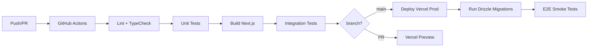
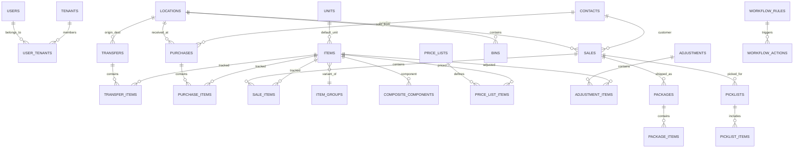

# WareOS v2 — Final Blueprint (Part 3 of 3)

## Testing · DevOps · Security · Scalability · Roadmap · ER Diagram

**Companion docs:**
- [Part 1 — Architecture, Multi-Tenancy, Auth, Database](./wareos_v2_final_part1.md)
- [Part 2 — Modules, Frontend, Background Jobs, Offline](./wareos_v2_final_part2.md)
- [Design System Reference](./design_reference.html)

**Last updated:** 2026-03-12

---

## 16. Testing Strategy

### Testing Pyramid

```
         ┌──────────┐
         │   E2E    │  10%  Playwright: login → create item → sale → receive
        ─┼──────────┼─
        │ Integration │  30%  Vitest: API routes + Drizzle + test DB
       ─┼────────────┼─
      │    Unit Tests    │  60%  Vitest: Zod, stock VIEW, utils
     ─┼──────────────────┼─
```

### Day-1 Test Requirements

| Area | What to Test |
|---|---|
| **Drizzle schemas** | All table definitions compile, FK/unique constraints valid |
| **Tenant scoping** | `withTenantScope()` never leaks cross-tenant data |
| **Stock VIEW** | Fixtures: purchases + sales + transfers → assert stock_levels |
| **JWT middleware** | Mock decode, verify permission checks |
| **Module registry** | Dependency resolution, circular dependency detection |
| **API routes** | Request validation, auth guard, Drizzle query correctness |
| **RLS policies** | Direct SQL bypassing app code cannot read other tenant's data |

### Growth-Phase Testing

| Type | Tool | Purpose |
|---|---|---|
| Visual regression | Playwright + Chromatic | CSS regression detection |
| Load testing | k6 | Multi-tenant concurrent API performance |
| Security | OWASP ZAP + Snyk | Vulnerability scanning |
| Contract | Zod schemas as source of truth | Frontend↔Backend type alignment |
| Offline sync (Phase 2) | Queue mutations offline → replay → verify server state | Sync engine correctness |

---

## 17. DevOps, CI/CD & Deployment

### Day-1 Infrastructure (Solution D)

| Component | Service | Tier | Cost | CLI Tool |
|---|---|---|---|---|
| Web app + API + Inngest | **Vercel** | Pro | $20/mo | `vercel` |
| Database + Auth + Realtime | **Supabase** | Free → Pro | $0 → $25/mo | `supabase` |
| Background jobs | **Inngest** | Free (50K runs) | $0 | `inngest-cli` |
| Cache / rate limiting | **Upstash Redis** | Free (10K cmd/day) | $0 | REST API |
| Email | **Resend** | Free (3K/month) | $0 | REST API |
| Error tracking | **Sentry** | Free (5K events) | $0 | `@sentry/nextjs` |
| **Total at launch** | | | **$20/mo** | |

### CI/CD Pipeline



### Migration (Simplified by Shared-Schema)

```bash
# One migration, all tenants benefit instantly
pnpm drizzle-kit generate  # Generate SQL from schema changes
pnpm drizzle-kit push       # Apply to production DB
# No loops, no partial failures, no schema #432 out-of-sync
```

### CLI-Driven Workflow (Claude Code Compatible)

| Operation | Command |
|---|---|
| Dev server | `pnpm dev` |
| Build | `pnpm build` |
| Unit tests | `pnpm test` |
| E2E tests | `pnpm test:e2e` |
| DB migration | `pnpm drizzle-kit push` |
| Deploy | `vercel deploy --prod` |
| Logs | `vercel logs` |
| Inngest dev | `npx inngest-cli dev` |

No SSH. No Docker. No server configuration. One repo, one command, one deployment target. This is why Solution D was chosen for a Claude Code build.

---

## 18. Security Hardening

### Day-1 Security (Non-Negotiable)

| Layer | Implementation |
|---|---|
| **Transport** | HTTPS via Vercel (enforced) |
| **Data isolation** | **RLS on every table** (tenant_id scoped) |
| **Auth** | Supabase Auth + JWT (no DB in middleware) |
| **Input validation** | Zod on every API boundary |
| **SQL injection** | Drizzle ORM parameterized queries (never raw string interpolation) |
| **Rate limiting** | Upstash Redis: 100 req/min per IP, 1000 req/min per tenant |
| **CSRF** | SameSite=Lax cookies + origin check |
| **Audit everything** | Append-only audit_log, all mutations logged |
| **Soft deletes** | `deleted_at` column, no permanent data loss |
| **Dependency scanning** | Dependabot + Snyk |

### Phase 2+ Security

| Enhancement | Detail | Phase |
|---|---|---|
| 2FA/MFA (TOTP) | Enable for admin/owner accounts | 2 |
| CSP headers | Strict Content-Security-Policy in `next.config.ts` | 2 |
| Session timeout | Configurable per tenant (default: 24h) | 2 |
| API keys | For third-party integrations (ERP, scanner apps) | 3 |
| IP allowlisting | Enterprise tenant option | 3 |
| Pen testing | Annual third-party assessment | 3 |
| PII policy | Data retention periods, anonymize old audit entries | 3 |

---

## 19. Scalability & Infrastructure

### Database Optimizations

| When | Do |
|---|---|
| Always | Indexes on `(tenant_id, ...)` for every query pattern |
| Always | Supabase PgBouncer (transaction mode) |
| 50K+ transactions | Materialized VIEW for stock_levels (Inngest cron refresh) |
| 100K+ audit entries | Partition `audit_log` by month |
| 50+ tenants | Supabase read replica for reports |
| JSONB queries | GIN index on `custom_fields` |
| Data > 2 years | Archive to cold storage |

### Infrastructure Scaling Phases

| Phase | Tenants | Stack | Cost |
|---|---|---|---|
| **Launch** | 1–50 | Vercel Pro + Supabase Free + Inngest Free + Upstash Free | **$20–$45/mo** |
| **Growth** | 50–500 | + Supabase Pro + Inngest Paid + Redis Pro + Sentry | **$100–$235/mo** |
| **Scale** | 500–5K | + Read replica + regional instances + dedicated workers | **$400–$800/mo** |
| **Enterprise** | 5K+ | K8s + dedicated PG + API gateway | Custom |

### Cost Trajectory (Detailed — Solution D)

| Scale | Vercel | Inngest | Supabase | Upstash | Resend | Sentry | Total |
|---|---|---|---|---|---|---|---|
| **Dev / Pre-revenue** | $20 | $0 | $0 | $0 | $0 | $0 | **$20/mo** |
| **Up to 50 tenants** | $20 | $0 | $25 | $0 | $0 | $0 | **$45/mo** |
| **50–200 tenants** | $20 | ~$50 | $25 | $5 | $0 | $0 | **$100/mo** |
| **200–500 tenants** | $20 | ~$150 | $35 | $10 | $20 | $0 | **$235/mo** |
| **500+ tenants** | $20 | ~$250 | $35+ | $15 | $20 | $26 | **$366/mo** |

Note: Inngest paid pricing is usage-based. At 200 tenants with daily cron + event-driven workflows, expect ~100–250K executions/month.

---

## 20. Feature Roadmap

### Phase 1 — MVP (Weeks 1–8)

> **6 core modules.** Get the core inventory loop working end-to-end.

| Feature | Priority | Module |
|---|---|---|
| Items, Locations, Units, Contacts (CRUD) | 🔴 Core | inventory |
| Sales Orders (draft → confirmed → dispatched) | 🔴 Core | sale |
| Purchase Orders (draft → ordered → received) | 🔴 Core | purchase |
| Transfer Orders (draft → dispatched → received) | 🔴 Core | transfer |
| stock_levels VIEW (computed, realtime) | 🔴 Core | inventory |
| Adjustments (qty + value) | 🔴 Core | adjustments |
| User management + roles (owner/admin/manager/operator/viewer) | 🔴 Core | user-management |
| Dashboard + 6 KPIs (Recharts) | 🟡 High | analytics (lite) |
| Audit trail (append-only log) | 🟡 High | audit-trail |
| Stock alerts (basic threshold check) | 🟡 High | stock-alerts |
| Payments (basic record) | 🟡 High | payments |
| Shortage tracking (computed on transfers) | 🟡 High | shortage-tracking |
| Online-only PWA (app shell caching, "offline" banner) | 🟡 High | — |
| Custom fields on all entities | 🟢 Medium | inventory |
| Global search (Cmd+K) | 🟢 Medium | — |
| Onboarding wizard | 🟢 Medium | — |

### Phase 2 — Growth (Weeks 9–16)

> **Feature depth + new modules.** The features that make WareOS competitive with Zoho.

| Feature | Priority | Module |
|---|---|---|
| Item Groups (variants: size, color, edition) | 🔴 Critical | item-groups |
| Lot/Batch tracking + expiry alerts + FIFO | 🔴 Critical | lot-tracking |
| Serial number tracking | 🔴 Critical | lot-tracking |
| Document generation (Challan, GRN, PO/SO PDF) | 🟡 High | document-gen |
| Barcode generation + scanning | 🟡 High | barcode |
| Bulk import/export (CSV via Inngest) | 🟡 High | bulk-import |
| Packages & Shipments (pack → ship → track) | 🟡 High | packages |
| Picklists for order fulfillment | 🟡 High | packages |
| Price Lists (customer-specific, percentage-based) | 🟡 High | price-lists |
| Returns (sale + purchase) with credit memos | 🟡 High | returns |
| **Full offline PWA** (IndexedDB sync, Dexie.js) | 🟡 High | — |
| Email notifications (dispatch, low stock, payment) | 🟢 Medium | — |
| Backorders (auto-create on stock-out) | 🟢 Medium | sale |
| Custom statuses per order type | 🟢 Medium | sale, purchase |
| Photo capture on receive (proof of condition) | 🟢 Medium | — |
| Multi-language (i18n) — Hindi, Tamil, Telugu | 🟢 Medium | — |

### Phase 3 — Enterprise (Weeks 17–32)

> **Automation, portals, and integrations.** Enterprise-grade features.

| Feature | Priority | Module |
|---|---|---|
| Automation / Workflow Rules (if-this-then-that) | 🔴 Critical | automation |
| Webhooks (event → POST to external URL) | 🔴 Critical | automation |
| Customer Portal (view orders, track shipments) | 🟡 High | — |
| Vendor Portal (view POs, confirm deliveries) | 🟡 High | — |
| Tally integration (export purchases/sales) | 🟡 High | — |
| Custom report builder (drag columns, save, schedule) | 🟡 High | analytics |
| Reporting tags (label entities → filter reports) | 🟡 High | analytics |
| **Bin/Shelf/Rack locations** (sub-warehouse tracking) | 🟡 High | inventory |
| **Shipping carrier integration** (Delhivery/Shiprocket) | 🟡 High | packages |
| Multi-currency handling | 🟢 Medium | — |
| Approval workflows (manager approval for high-value) | 🟢 Medium | — |
| WhatsApp notifications (via Twilio/Gupshup) | 🟢 Medium | — |
| Custom PDF templates (tenant-branded) | 🟢 Medium | document-gen |
| API keys for third-party integrations | 🟢 Medium | — |

### Phase 4 — Platform (Month 8–12+)

| Feature | Priority |
|---|---|
| White-labeling (tenant branding: logo, colors, domain) | 🟡 High |
| SSO / SAML (Google Workspace, Azure AD) | 🟡 High |
| Composite Items / BOM (kit assembly from components) | 🟡 High |
| React Native mobile app (Expo) | 🟡 High |
| AI demand forecasting (predict demand, suggest purchase qty) | 🟢 Medium |
| IoT sensor integration (temperature, humidity for cold chains) | 🟢 Medium |
| Warehouse map view (visual floor plan with bins) | 🟢 Medium |
| Dark mode | 🟢 Medium |
| Module marketplace (third-party SDK/ecosystem) | 🟢 Medium |

---

## 21. Entity-Relationship Diagram



---

## 22. Key Day-1 Decisions Summary

| Decision | Choice | Why |
|---|---|---|
| **Architecture** | **Vercel Pro + Inngest (Solution D)** | Single-deploy, CLI-driven, Claude Code compatible. No Docker/SSH. |
| **Multi-tenancy** | Shared-schema + `tenant_id` + RLS | No migration explosion, standard pooling |
| **ORM** | Drizzle | Type-safe, edge-compatible, lightweight, near-SQL |
| **Framework** | **Next.js 15** (stable) | Well-documented. Upgrade to 16 when stable. |
| **Middleware** | JWT-only (zero DB hits) | Global performance |
| **Background jobs** | Inngest (>5s = Inngest) | Durable step functions, event bus, cron |
| **Offline** | **Online-only PWA Phase 1, full offline Phase 2** | Sync engine is hardest feature — defer until validated |
| **Naming** | Items (not commodities) | General-purpose, any industry |
| **Accounting** | Excluded (Tally export only) | Don't duplicate Tally |
| **Event bus** | Inngest events | Modules decoupled, never direct imports |
| **Cache** | Upstash Redis from day 1 | Rate limiting, JWT blocklist, stock snapshots |
| **Enterprise isolation** | Dedicated Supabase instance (upsell) | Code unchanged, deployment config only |
| **Hosting cost** | $20/mo floor (Vercel Pro) | Commercial use requires Pro. Acceptable trade-off for zero DevOps. |
| **MVP scope** | 6 modules, not 20 | Ship core loop first. Module registry supports incremental additions. |

---

## 23. What NOT to Build in Phase 1

> [!CAUTION]
> **Claude Code should not attempt these features in the initial build.** They are architecturally supported but deferred to later phases.

| Feature | Why Not Phase 1 |
|---|---|
| Full offline PWA sync | Hardest feature in the blueprint. Online-only with banner is fine for MVP. |
| Barcode scanning | Needs offline to be truly useful in warehouses. Phase 2. |
| Document generation (PDFs) | Nice-to-have. Manual challans work for first 50 customers. |
| Bulk import (CSV) | Copy-paste or manual entry is fine at launch scale. |
| Full analytics dashboard | Basic KPIs in Phase 1. Full reports are Phase 2. |
| Item groups / variants | Core items first. Variants add schema complexity. |
| Packages & shipments | Sales dispatch covers 80% of the use case. |
| Price lists | Single price per item is fine for launch. |
| Automation / workflows | Way too complex. Phase 3. |
| Webhooks | No external integrations needed at launch. |
| Customer/vendor portals | Self-service is a growth feature. |
| Lot/batch/serial tracking | Adds complexity to every transaction. Phase 2. |
| Bin/shelf/rack locations | Only needed for 500+ SKU warehouses. Phase 3. |
| Shipping carrier integration | Manual tracking numbers work initially. Phase 3. |

---

> [!NOTE]
> This blueprint is the **Claude Code build reference**. All architectural decisions are final. The phased roadmap should be followed in order — prioritize based on customer feedback only within each phase, not across phases.
