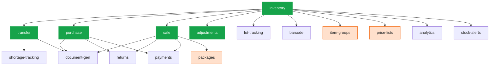

# WareOS v2 — Final Blueprint (Part 2 of 3)

## Modules · Frontend Architecture · Background Jobs · Mobile Operator View

**Companion docs:**
- [Part 1 — Architecture, Multi-Tenancy, Auth, Database](./wareos_v2_final_part1.md)
- [Part 3 — Testing, DevOps, Security, Scalability, Roadmap](./wareos_v2_final_part3.md)
- [Design System Reference](./design_reference.html)

**Last updated:** 2026-03-13

---

## 9. Module Registry (Plug-and-Play)

### Module Manifest Interface

Each module exports a typed manifest. The sidebar, API guards, and event bus all read from this registry.

```typescript
// core/modules/registry.ts
export interface ModuleManifest {
  id: string;                      // kebab-case: "item-groups"
  name: string;                    // "Item Groups"
  description: string;
  version: string;                 // semver: "1.0.0"
  icon: string;                    // Lucide icon name
  dependencies: string[];          // ["inventory"]
  permissions: Permission[];       // Permissions this module introduces
  routes: {
    path: string;                  // Relative to /t/{slug}/
    label: string;
    icon: string;
    permission?: Permission;
    group: 'inventory' | 'orders' | 'warehouse' | 'settings' | 'reports';
  }[];
  events?: {                       // Events this module emits
    name: string;
    payload: ZodSchema;
  }[];
  hooks?: {                        // Events this module listens to
    event: string;
    handler: string;               // Path to Supabase Edge Function
  }[];
}
```

### 20 Modules — Build Phase Clearly Marked

> [!IMPORTANT]
> **Phase 1 MVP builds 6 modules.** Phase 1 is complete. The remaining 14 are architecturally supported by the module registry and are added incrementally. Claude Code works on Phase 2 modules next.

| # | Module | Deps | Build Phase | Key Tables |
|---|---|---|---|---|
| 1 | `inventory` | — | **Phase 1 ✅ DONE** | items, locations, units, contacts |
| 2 | `transfer` | inventory | **Phase 1 ✅ DONE** | transfers, transfer_items |
| 3 | `purchase` | inventory | **Phase 1 ✅ DONE** | purchases, purchase_items |
| 4 | `sale` | inventory | **Phase 1 ✅ DONE** | sales, sale_items |
| 5 | `adjustments` | inventory | **Phase 1 ✅ DONE** | adjustments, adjustment_items |
| 6 | `user-management` | — | **Phase 1 ✅ DONE** | user_profiles, user_locations |
| 7 | `audit-trail` | — | Phase 1 (lite) ✅ | audit_log |
| 8 | `stock-alerts` | inventory | Phase 1 (lite) ✅ | alert_thresholds |
| 9 | `analytics` | inventory | Phase 1 (lite) ✅ | (views only — basic KPIs) |
| 10 | `shortage-tracking` | transfer | Phase 1 (lite) ✅ | (computed columns on transfer_items) |
| 11 | `payments` | purchase, sale | Phase 1 (lite) ✅ | payments |
| 12 | `document-gen` | transfer, sale, purchase | Phase 2 | (PDF via Supabase Edge Functions) |
| 13 | `barcode` | inventory | Phase 2 | (barcode/QR generation) |
| 14 | `bulk-import` | inventory | Phase 2 | (CSV processing via chunked API + job_progress) |
| 15 | `lot-tracking` | inventory | Phase 2 | lots, batches |
| 16 | `item-groups` | inventory | Phase 2 | item_groups |
| 17 | `packages` | sale | Phase 2 | packages, package_items, picklists |
| 18 | `price-lists` | inventory | Phase 2 | price_lists, price_list_items |
| 19 | `returns` | purchase, sale | Phase 2 | returns, return_items |
| 20 | `automation` | — | Phase 4 | workflow_rules, workflow_actions (requires Inngest) |

**Phase 1 "lite" modules** = tables exist, basic CRUD works, but no advanced UI or background jobs yet. They're scaffolded so the architecture is complete.

### Sidebar Runtime Filtering

```typescript
const enabledModules = user.appMetadata.enabled_modules;
const navItems = moduleRegistry
  .getAll()
  .filter(m => enabledModules.includes(m.id))
  .flatMap(m => m.routes)
  .filter(r => !r.permission || userHasPermission(r.permission));
```

### Dependency Graph



*Green = Phase 1 MVP (done). Orange outline = Phase 2 new modules.*

### Event Bus (Supabase Database Webhooks + Edge Functions)

Modules communicate via typed events — never direct imports. In Phase 1–3, this is implemented using **Supabase Database Webhooks** that trigger **Edge Functions**. In Phase 4, Inngest replaces this with durable, retryable step functions.

```typescript
// core/events/types.ts — event contracts stay the same regardless of transport
export const AppEvents = {
  'sale/confirmed':        z.object({ saleId: z.string().uuid(), tenantId: z.string() }),
  'sale/dispatched':       z.object({ saleId: z.string().uuid(), tenantId: z.string() }),
  'purchase/received':     z.object({ purchaseId: z.string().uuid(), tenantId: z.string() }),
  'transfer/dispatched':   z.object({ transferId: z.string().uuid(), tenantId: z.string() }),
  'transfer/received':     z.object({ transferId: z.string().uuid(), tenantId: z.string() }),
  'stock/below-threshold': z.object({ itemId: z.string(), locationId: z.string(), current: z.number(), threshold: z.number() }),
  'item/created':          z.object({ itemId: z.string().uuid(), tenantId: z.string() }),
  'item/updated':          z.object({ itemId: z.string().uuid(), tenantId: z.string() }),
} as const;
```

**How events are dispatched (Phase 1–3):**

```typescript
// core/events/dispatch.ts
// After a DB mutation in an API route, fire-and-forget to Supabase Edge Function
export async function dispatchEvent(eventName: string, payload: unknown) {
  await supabase.functions.invoke('event-handler', {
    body: { event: eventName, payload },
  });
}

// Usage in API route (after sale is confirmed):
await dispatchEvent('sale/confirmed', { saleId: sale.id, tenantId: ctx.tenantId });
```

**Supabase Edge Function handles the event:**

```typescript
// supabase/functions/event-handler/index.ts
Deno.serve(async (req) => {
  const { event, payload } = await req.json();
  switch (event) {
    case 'sale/confirmed':
      await checkStockAlerts(payload);
      // Phase 2+: await autoCreatePicklist(payload);
      break;
    case 'transfer/received':
      await computeShortages(payload);
      break;
    case 'stock/below-threshold':
      await sendStockAlertEmail(payload);
      break;
  }
  return new Response('ok');
});
```

**Phase 1 event flow:**
```
sale/confirmed → stock-alerts: check if items drop below threshold
transfer/received → shortage-tracking: compute shortages
```

**Phase 2+ event flow (added later, same Edge Function, new cases):**
```
sale/confirmed → packages: auto-create picklist
stock/below-threshold → email: send low-stock notification
```

**Phase 4: Inngest replaces Edge Function event bus** for flows that need retry guarantees or multi-step durability.

### Example Module Registration

```typescript
export const PackagesModule: ModuleManifest = {
  id: 'packages',
  name: 'Packages & Shipments',
  version: '1.0.0',
  description: 'Pack, ship, and track package deliveries',
  icon: 'PackageCheck',
  dependencies: ['sale'],
  permissions: ['packages:create', 'packages:update', 'shipments:track'],
  routes: [
    { path: 'packages', label: 'Packages', icon: 'PackageCheck', permission: 'packages:create', group: 'orders' },
  ],
  hooks: [
    { event: 'sale/confirmed', handler: 'event-handler' },  // Supabase Edge Function
  ],
};
```

---

## 10. Frontend Architecture

### Design System (from design_reference.html)

Light Swiss-editorial theme with `#F45F00` orange primary.

**7 Design Principles (non-negotiable for Claude Code):**
1. White cards on off-white pages (`--bg-base` on `--bg-off`)
2. Typography: only 400 (regular) and 700 (bold) weights, system sans-serif
3. Orange marks every interaction point (CTA pills, focus rings)
4. Orange left-border = active nav state (all three together: border + bg + color)
5. Status badges = pill shape; type labels = rect shape
6. Always use `--accent-color` token, never inline `#F45F00`
7. Never use inline color values; always use CSS custom property tokens

**Key Design Tokens:**

| Token | Value | Purpose |
|---|---|---|
| `--bg-base` | `#FFFFFF` | Cards, panels, primary surfaces |
| `--bg-off` | `#F7F6F4` | Page bg, sidebar tint, row hover |
| `--bg-ink` | `#0A0A0A` | Footer, toasts, dark sections |
| `--accent-color` | `#F45F00` | CTA buttons, active nav, focus rings |
| `--accent-dark` | `#C94F00` | Hover state on orange elements |
| `--accent-tint` | `#F45F000F` | Active nav bg, row highlights |
| `--green` | `#16A34A` | Received, confirmed, success |
| `--blue` | `#2563EB` | Purchase, confirmed-sale |
| `--red` | `#DC2626` | Cancelled, errors, destructive |
| `--border` | `rgba(0,0,0,0.08)` | Default borders, dividers |
| `--sidebar-w` | `240px` | Desktop sidebar width |
| `--header-h` | `60px` | Desktop app header |
| `--mobile-header-h` | `56px` | Mobile header (4px shorter) |
| `--mobile-nav-h` | `72px` | Mobile bottom nav |
| `--btn-h` / `--btn-h-lg` | `40px` / `48px` | Button heights |
| `--card-radius` | `12px` | Card border-radius |
| `--input-h` | `38px` | Input height |

**Typography Scale:** 32px (page titles) → 24px (sections) → 18px (card titles) → 15px (body) → 13px (seq numbers) → 12px (timestamps, headers, labels)

**Button Variants:** `btn--orange` (primary CTA pill), `btn--ghost` (secondary pill), `btn--outline-orange`, `btn--ink` (dark), `btn--subtle` (rect), `btn--destructive`, `btn--icon-only`

**Badge Variants:** `.badge.received` (green), `.badge.dispatched` (orange), `.badge.confirmed` (blue), `.badge.cancelled` (red), `.badge.pending` (muted)

**Type Labels:** `.type-badge.dispatch` (orange rect), `.type-badge.purchase` (blue rect), `.type-badge.sale` (green rect)

### Page & Component Patterns

| Pattern | Description |
|---|---|
| **Server Component → Client Table** | `page.tsx` (fetch) → `items-table.tsx` (TanStack, sorting, filtering) |
| **Form Hook Extraction** | `use-sale-form.ts` extracts state logic from form UI |
| **Responsive Dual** | Desktop + Mobile components for same view |
| **Global Search (Cmd+K)** | Debounced 300ms, searches items/orders/contacts/locations |
| **Module-Aware Sidebar** | Iterates module registry, filters by JWT `enabled_modules` + permissions |
| **Skeleton Loading** | Every data view has a loading skeleton |
| **Toast (Sonner)** | Dark ink toasts with colored icon circles, undo for destructive actions |
| **Keyboard Shortcuts** | `N` = new, `S` = save, `Esc` = cancel, `/` = search |
| **Empty States** | Table empty + full-page empty with CTA button |

### Application Optimizations

| Optimization | Detail |
|---|---|
| **TanStack Query** | Client-side stale-while-revalidate for all data fetching |
| **Streaming SSR** | React Suspense for dashboard KPIs (show shell instantly) |
| **Dynamic imports** | DateRangePicker, PDF renderer, charts, barcode scanner |
| **ISR** | 5-min revalidation for analytics pages |
| **Bundle analysis** | `@next/bundle-analyzer`, alert on growth > 10% |
| **Edge caching** | Vercel Edge Config for tenant metadata |

---

## 11. Background Jobs: Vercel Cron + Supabase Edge Functions

> [!IMPORTANT]
> **Phase 1–3 background jobs run on Vercel Cron (scheduled) and Supabase Edge Functions (event-driven).** Any operation that could take >5 seconds should use Supabase Edge Functions, which have a 150-second timeout and run outside the Vercel function lifecycle. Inngest is introduced in Phase 4 for durable step functions and workflow automation.

| Operation | Where It Runs | Timeout | Phase |
|---|---|---|---|
| Create/update single record | Vercel API Route | ~200ms | 1 |
| Stock alert check (cron) | Vercel Cron → API Route | 5 min | 1 |
| Bulk import (CSV, up to 10K rows) | Supabase Edge Function (chunked) | 150s | 2 |
| Generate PDF report | Supabase Edge Function | 150s | 2 |
| Materialized VIEW refresh | Vercel Cron → API Route | 5 min | Growth |
| Send email notifications | Supabase Edge Function | 150s | 2 |
| Webhook delivery (Phase 3) | Supabase Edge Function + pg_net | 150s | 3 |
| Durable workflow automation | **Inngest** | Unlimited steps | **4** |

### Vercel Cron Configuration

```typescript
// vercel.json
{
  "crons": [
    {
      "path": "/api/cron/stock-alerts",
      "schedule": "*/5 * * * *"   // Every 5 minutes
    },
    {
      "path": "/api/cron/refresh-stock-view",
      "schedule": "*/5 * * * *"   // Every 5 minutes (when materialized view is enabled)
    },
    {
      "path": "/api/cron/scheduled-reports",
      "schedule": "0 6 * * *"     // Daily at 6am
    }
  ]
}
```

```typescript
// src/app/api/cron/stock-alerts/route.ts
// Protected by CRON_SECRET — Vercel sets this header automatically
export async function GET(req: NextRequest) {
  if (req.headers.get('Authorization') !== `Bearer ${process.env.CRON_SECRET}`) {
    return new Response('Unauthorized', { status: 401 });
  }

  // Check all tenants for items below threshold
  const thresholds = await db.select().from(alertThresholds)
    .innerJoin(stockLevels, eq(stockLevels.itemId, alertThresholds.itemId));

  for (const t of thresholds) {
    if (t.currentStock <= t.threshold) {
      await supabase.functions.invoke('event-handler', {
        body: {
          event: 'stock/below-threshold',
          payload: { itemId: t.itemId, locationId: t.locationId, current: t.currentStock, threshold: t.threshold },
        },
      });
    }
  }

  return Response.json({ checked: thresholds.length });
}
```

### Bulk Import Pattern (No Inngest — Phase 2)

The approach: API creates a `job_progress` record, then a Supabase Edge Function processes the file in a loop with progress updates tracked in the DB. The client polls `/api/v1/t/{slug}/jobs/{jobId}` for status.

```
User uploads CSV → API saves file to Supabase Storage → creates job_progress record → returns jobId
                 → API invokes Edge Function async (no-wait)
                 → Edge Function: parse → chunk → insert 500 rows at a time → update job_progress.processed
                 → Client polls job status → shows progress bar → notifies on completion
```

```typescript
// supabase/functions/bulk-import/index.ts
Deno.serve(async (req) => {
  const { jobId, fileUrl, tenantId } = await req.json();

  await updateJobStatus(jobId, 'running');

  try {
    const file = await fetch(fileUrl);
    const rows = parseCsv(await file.text());
    const chunks = chunkArray(rows, 500);

    for (let i = 0; i < chunks.length; i++) {
      await bulkInsertItems(tenantId, chunks[i]);
      await updateJobProgress(jobId, {
        processed: (i + 1) * 500,
        total: rows.length,
      });
    }

    await updateJobStatus(jobId, 'completed');
  } catch (err) {
    await updateJobStatus(jobId, 'failed', err.message);
  }

  return new Response('ok');
});
```

> **Limitation vs Inngest**: If the Edge Function times out at 150s or crashes, the job fails and must be retried from scratch. For Phase 2 this is acceptable — files should be capped at ~10K rows. Phase 4 introduces Inngest durable steps for true resume-from-checkpoint on larger imports.

### PDF Generation Pattern (Phase 2)

```typescript
// supabase/functions/generate-pdf/index.ts
// Called from API route after user requests a report
Deno.serve(async (req) => {
  const { jobId, reportType, tenantId, params } = await req.json();

  await updateJobStatus(jobId, 'running');

  const data = await fetchReportData(reportType, tenantId, params);
  const pdfBytes = await renderPdf(reportType, data);

  // Upload to Supabase Storage
  const { data: upload } = await supabase.storage
    .from('reports')
    .upload(`${tenantId}/${jobId}.pdf`, pdfBytes, { contentType: 'application/pdf' });

  await updateJobStatus(jobId, 'completed', null, upload.path);

  return new Response('ok');
});
```

### File Structure

```
src/app/api/cron/
├── stock-alerts/route.ts         ← Vercel Cron: check thresholds every 5 min (Phase 1)
├── refresh-stock-view/route.ts   ← Vercel Cron: refresh materialized view (Growth)
└── scheduled-reports/route.ts   ← Vercel Cron: trigger scheduled email reports (Phase 2)

supabase/functions/
├── event-handler/index.ts        ← Central event dispatcher (replaces Inngest event bus)
├── bulk-import/index.ts          ← Chunked CSV/Excel import with progress (Phase 2)
├── generate-pdf/index.ts         ← PDF report generation → Supabase Storage (Phase 2)
├── send-email/index.ts           ← Resend email dispatch (Phase 2)
└── webhook-delivery/index.ts     ← POST to tenant webhook URLs with basic retry (Phase 3)
```

---

## 12. Real-Time Features

| Feature | Implementation | Phase |
|---|---|---|
| **Live stock levels** | Supabase Realtime on transfer/purchase/sale events | 1 |
| **Transfer tracking** | Status updates pushed to all viewers of a transfer | 1 |
| **Notifications bell** | In-app notification center (stock alerts, arrivals) | 1 (basic) |
| **Job progress bar** | Client polls `/api/v1/t/{slug}/jobs/{jobId}` every 2s | 2 |
| **Webhook fan-out** | DB mutation → Supabase Edge Function → POST to tenant URLs | 3 |
| **Durable webhooks** (guaranteed retry) | Inngest | **4** |
| **Presence** | Show who's viewing the same order/form | Phase 3+ |

---

## 13. Mobile Operator View

> [!IMPORTANT]
> **No offline mode. No service worker data caching. No IndexedDB. No Dexie.js.**
> The operator experience is a **dedicated set of mobile-optimized pages inside the same Next.js app**, online only. Operators open the URL in a mobile browser — always connected, always live data. This is the lightest viable approach: no separate app, no sync engine, no complexity.

### What It Is

A set of operator-specific routes within the existing Next.js app, designed exclusively for small screens and touch interaction. The same Supabase Auth, same API routes, same data — just a different UI surface tuned for warehouse floor use.

```
app/
└── t/[tenantSlug]/
    └── operator/               ← Operator-only mobile routes
        ├── page.tsx             ← Operator home: active picklists + pending transfers
        ├── receive/
        │   └── [transferId]/   ← Enter received quantities, one item at a time
        ├── pick/
        │   └── [picklistId]/   ← Work through a picklist, tap to confirm each item
        └── scan/
            └── page.tsx        ← Barcode scan → item lookup (Phase 2)
```

### Design Rules for Operator Pages

These pages follow the same design system tokens but apply a different layout contract — optimised for one-handed use on a phone:

| Rule | Detail |
|---|---|
| **Single action per screen** | One primary button per view. No dense tables. |
| **Touch targets ≥ 48px** | All tappable elements meet minimum touch target size |
| **Bottom-anchored CTA** | Primary action button fixed to bottom of screen |
| **Large quantity inputs** | Full-width numeric input, large font, no decimal keyboard |
| **Item cards not rows** | Items shown as stacked cards, not table rows |
| **No sidebar** | Full-width layout. Bottom tab nav for operator sections only. |
| **Status always visible** | Connection indicator in top bar — red banner if offline |

### Operator Workflows (Phase 1 — Online Only)

| Workflow | How |
|---|---|
| **Receive a transfer** | Operator opens transfer link → taps through items → enters qty received → submits. Stock updates immediately via API. |
| **Work a picklist** | Operator opens assigned picklist → taps each item to confirm pick → marks picklist complete. |
| **View location stock** | Filtered stock view for the operator's assigned location only (`user_locations` restriction applies). |
| **Raise an adjustment** | Simple form: select item, enter qty change, reason. Subject to same approval rules as desktop. |

### Barcode Scanning (Phase 2 — Still Online)

When the `barcode` module is enabled in Phase 2, operators can scan barcodes using the device camera via the browser's `MediaDevices` API. Scanning is fully online — the scan fires an API call to look up the item, the result is shown immediately. No local catalog caching is needed.

```typescript
// Barcode scan flow — online only
const stream = await navigator.mediaDevices.getUserMedia({ video: { facingMode: 'environment' } });
// ZXing or QuaggaJS decodes the frame
// → POST /api/v1/t/{slug}/items/lookup-barcode
// → Returns item details immediately from live DB
```

### Accessing the Operator View

Operators are sent a direct URL: `app.wareos.in/t/{slug}/operator`

- Works on any mobile browser — Chrome, Safari
- No app store. No install step.
- Bookmark or "Add to Home Screen" gives an icon on the home screen (basic web app manifest: icon + name + display: standalone). **This is not a PWA with a service worker** — it is purely a bookmark shortcut to the operator URL.
- If connectivity drops, the page shows a "No internet connection" banner and disables submit buttons. No data is cached, no queuing. Operators wait for reconnection.

### What Is Explicitly NOT Built

| Excluded | Reason |
|---|---|
| Service worker data caching | Adds sync complexity with no validated user need |
| IndexedDB / Dexie.js | Not needed without offline capability |
| Offline queue + conflict resolution | Eliminates the hardest class of bug in the system |
| Background sync API | No offline = no background sync |
| Push notifications (web) | Addressed via email/WhatsApp in Phase 3 instead |

---

## 14. Document Generation & Barcodes (Phase 2)

### PDF Templates

| Document | Trigger | Module | Template Customizable? |
|---|---|---|---|
| Delivery Challan | Transfer created | document-gen | ✅ |
| GRN (Goods Received Note) | Purchase or Transfer received | document-gen | ✅ |
| Packing Slip | Package created | packages | ✅ |
| Sales Order PDF | Sale confirmed | document-gen | ✅ |
| Purchase Order PDF | Purchase created | document-gen | ✅ |
| Credit Note | Return created | returns | ✅ |

PDF generation runs in a **Supabase Edge Function** (`generate-pdf`). The API route creates a `job_progress` record and invokes the Edge Function without waiting. The client polls for completion and gets a Supabase Storage download URL when done.

Tenant settings store template config (logo, header, footer, column visibility) as JSONB.

### Barcode Workflows (Phase 2)

| Feature | Detail |
|---|---|
| **Generate** | 1D (Code128) for item SKU, QR for transfer tracking URL |
| **Scan to add** | Camera/scanner adds line items to orders |
| **Serial/Batch scan** | Scan serial number on receive; auto-assign to transfer/purchase |
| **Bulk print** | Label sheets (Zebra/thermal via browser Print API) |

---

## 15. Analytics & Reports

### Dashboard KPIs (Phase 1 — Basic)

Total stock value · Items below reorder · Open orders · Transfers in-transit · Revenue (period) · Top-selling items

Charts via **Recharts**: stock trend lines, movement bar charts, top-items pie.

### Reports (Phase 2+)

| Category | Reports | Phase |
|---|---|---|
| **Inventory** | Stock summary, Valuation (FIFO), Aging, Item-wise, Location-wise, Stock movement | 2 |
| **Sales** | By item, By customer, By period, Returns summary | 2 |
| **Purchases** | By item, By vendor, Returns summary, Vendor delivery performance | 2 |
| **Warehouse** | Transfer summary, Shortage analysis, Location utilization, Turnover ratio | 2 |
| **Activity** | Audit trail, User activity log | 1 (basic) |
| **Advanced** | Custom report builder, Scheduled email reports, Reporting tags | 3 |

**Heavy reports** (inventory valuation, month-end summaries) → **Supabase Edge Function** (`generate-pdf`) → store PDF in Supabase Storage → poll `job_progress` for completion → notify user when ready.

---

> **Continues in [Part 3](./wareos_v2_final_part3.md)** → Testing, DevOps, Security, Scalability, Feature Roadmap, ER Diagram
