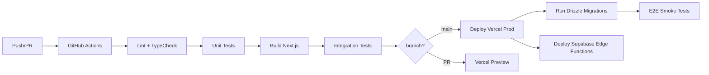
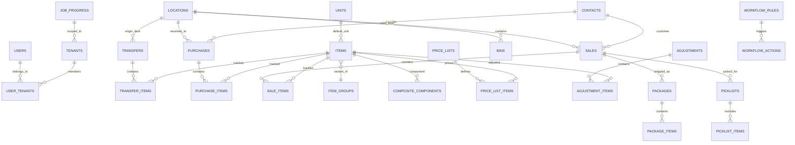

# WareOS v2 — Final Blueprint (Part 3 of 3)

## Testing · DevOps · Security · Scalability · Roadmap · ER Diagram

**Companion docs:**
- [Part 1 — Architecture, Multi-Tenancy, Auth, Database](./wareos_v2_final_part1.md)
- [Part 2 — Modules, Frontend, Background Jobs, Mobile Operator View](./wareos_v2_final_part2.md)
- [Design System Reference](./design_reference.html)

**Last updated:** 2026-03-13

---

## 16. Testing Strategy

### Testing Pyramid

```
         ┌──────────┐
         │   E2E    │  10%  Playwright: login → create item → sale → receive
        ─┼──────────┼─
        │ Integration │  30%  Vitest: API routes + Drizzle + test DB
       ─┼────────────┼─
      │    Unit Tests    │  60%  Vitest: Zod, stock VIEW, utils
     ─┼──────────────────┼─
```

### Day-1 Test Requirements

| Area | What to Test |
|---|---|
| **Drizzle schemas** | All table definitions compile, FK/unique constraints valid |
| **Tenant scoping** | `withTenantScope()` never leaks cross-tenant data |
| **Stock VIEW** | Fixtures: purchases + sales + transfers → assert stock_levels |
| **JWT middleware** | Mock decode, verify permission checks |
| **Module registry** | Dependency resolution, circular dependency detection |
| **API routes** | Request validation, auth guard, Drizzle query correctness |
| **RLS policies** | Direct SQL bypassing app code cannot read other tenant's data |
| **Vercel Cron routes** | Mock CRON_SECRET header, assert alert logic runs correctly |
| **Edge Function handlers** | Unit test event-handler switch cases with mock DB calls |

### Growth-Phase Testing

| Type | Tool | Purpose |
|---|---|---|
| Visual regression | Playwright + Chromatic | CSS regression detection |
| Load testing | k6 | Multi-tenant concurrent API performance |
| Security | OWASP ZAP + Snyk | Vulnerability scanning |
| Contract | Zod schemas as source of truth | Frontend↔Backend type alignment |
| Job progress polling | Vitest: mock Edge Function → verify job_progress updates | Bulk import reliability |

---

## 17. DevOps, CI/CD & Deployment

### Infrastructure by Phase

| Phase | Component | Service | Tier | Cost |
|---|---|---|---|---|
| **Phase 1 (now)** | Web app + API + Cron | Vercel | Pro | $20/mo |
| **Phase 1 (now)** | Database + Auth + Realtime + Edge Functions | Supabase | Free | $0/mo |
| **Phase 1 (now)** | Cache / rate limiting | Upstash Redis | Free | $0/mo |
| **Phase 1 (now)** | Email | Resend | Free (3K/mo) | $0/mo |
| **Phase 1 (now)** | Error tracking | Sentry | Free (5K events) | $0/mo |
| **Phase 3 upgrade** | Database | Supabase | Pro | $25/mo |
| **Phase 3 upgrade** | Cache | Upstash Redis | Paid | $5/mo |
| **Phase 4** | Durable workflows | Inngest | Paid | ~$50–$250/mo |
| **Phase 1–3 total** | | | | **$20/mo → $50/mo** |

### CI/CD Pipeline



### Migration (Simplified by Shared-Schema)

```bash
# One migration, all tenants benefit instantly
pnpm drizzle-kit generate  # Generate SQL from schema changes
pnpm drizzle-kit push       # Apply to production DB
# No loops, no partial failures, no schema #432 out-of-sync
```

### Supabase Edge Functions Deployment

```bash
# Deploy all Edge Functions to Supabase
supabase functions deploy event-handler
supabase functions deploy bulk-import
supabase functions deploy generate-pdf
supabase functions deploy send-email
supabase functions deploy webhook-delivery  # Phase 3
```

Edge Functions are deployed independently of the Next.js app. They live in `supabase/functions/` and are versioned in the same repo.

### CLI-Driven Workflow (Claude Code Compatible)

| Operation | Command |
|---|---|
| Dev server | `pnpm dev` |
| Build | `pnpm build` |
| Unit tests | `pnpm test` |
| E2E tests | `pnpm test:e2e` |
| DB migration | `pnpm drizzle-kit push` |
| Deploy app | `vercel deploy --prod` |
| Deploy Edge Functions | `supabase functions deploy <name>` |
| App logs | `vercel logs` |
| Edge Function logs | `supabase functions logs <name>` |
| Local Edge Function dev | `supabase functions serve` |

No SSH. No Docker. No server configuration. One repo, one deployment target per layer.

---

## 18. Security Hardening

### Day-1 Security (Non-Negotiable)

| Layer | Implementation |
|---|---|
| **Transport** | HTTPS via Vercel (enforced) |
| **Data isolation** | **RLS on every table** (tenant_id scoped) |
| **Auth** | Supabase Auth + JWT (no DB in middleware) |
| **Input validation** | Zod on every API boundary |
| **SQL injection** | Drizzle ORM parameterized queries (never raw string interpolation) |
| **Rate limiting** | Upstash Redis: 100 req/min per IP, 1000 req/min per tenant |
| **CSRF** | SameSite=Lax cookies + origin check |
| **Audit everything** | Append-only audit_log, all mutations logged |
| **Soft deletes** | `deleted_at` column, no permanent data loss |
| **Dependency scanning** | Dependabot + Snyk |
| **Cron protection** | Vercel Cron routes check `CRON_SECRET` header |
| **Edge Function auth** | Edge Functions validate `service_role` key or internal JWT |

### Phase 2+ Security

| Enhancement | Detail | Phase |
|---|---|---|
| 2FA/MFA (TOTP) | Enable for admin/owner accounts | 2 |
| CSP headers | Strict Content-Security-Policy in `next.config.ts` | 2 |
| Session timeout | Configurable per tenant (default: 24h) | 2 |
| API keys | For third-party integrations (ERP, scanner apps) | 3 |
| IP allowlisting | Enterprise tenant option | 3 |
| Pen testing | Annual third-party assessment | 3 |
| PII policy | Data retention periods, anonymize old audit entries | 3 |

---

## 19. Scalability & Infrastructure

### Database Optimizations

| When | Do |
|---|---|
| Always | Indexes on `(tenant_id, ...)` for every query pattern |
| Always | Supabase PgBouncer (transaction mode) |
| 50K+ transactions | Materialized VIEW for stock_levels (Vercel Cron refresh every 5 min) |
| 100K+ audit entries | Partition `audit_log` by month |
| Phase 3 upgrade | Supabase Pro for read replica on analytics queries |
| JSONB queries | GIN index on `custom_fields` |
| Data > 2 years | Archive to cold storage |

### Infrastructure Scaling Phases

| Phase | Tenants | Stack | Cost |
|---|---|---|---|
| **Phase 1 (done)** | 1–50 | Vercel Pro + Supabase Free + Upstash Free | **$20/mo** |
| **Phase 2 (Growth)** | 50–200 | Same stack + Resend paid | **$20–$40/mo** |
| **Phase 3 (Pro Upgrade)** | 200–500 | + Supabase Pro + Upstash Paid + Sentry | **$50–$75/mo** |
| **Phase 4 (Inngest)** | 500–2K | + Inngest Paid | **$100–$300/mo** |
| **Scale** | 2K–5K | + Read replica + regional Edge Functions | **$300–$600/mo** |
| **Enterprise** | 5K+ | Dedicated Supabase + K8s | Custom |

### Cost Trajectory (Detailed)

| Scale | Vercel | Supabase | Upstash | Resend | Sentry | Inngest | Total |
|---|---|---|---|---|---|---|---|
| **Phase 1 (now)** | $20 | $0 | $0 | $0 | $0 | — | **$20/mo** |
| **Phase 2** | $20 | $0 | $0 | $0 | $0 | — | **$20/mo** |
| **Phase 3 (Pro upgrade)** | $20 | $25 | $5 | $20 | $0 | — | **$70/mo** |
| **Phase 4 (add Inngest)** | $20 | $25 | $10 | $20 | $26 | ~$50 | **$151/mo** |
| **Scale (500+ tenants)** | $20 | $35+ | $15 | $20 | $26 | ~$250 | **$366/mo** |

---

## 20. Feature Roadmap

### Phase 1 — MVP ✅ COMPLETE

> **6 core modules. Core inventory loop working end-to-end.**

| Feature | Status | Module |
|---|---|---|
| Items, Locations, Units, Contacts (CRUD) | ✅ Done | inventory |
| Sales Orders (draft → confirmed → dispatched) | ✅ Done | sale |
| Purchase Orders (draft → ordered → received) | ✅ Done | purchase |
| Transfer Orders (draft → dispatched → received) | ✅ Done | transfer |
| stock_levels VIEW (computed, realtime) | ✅ Done | inventory |
| Adjustments (qty + value) | ✅ Done | adjustments |
| User management + roles (owner/admin/manager/operator/viewer) | ✅ Done | user-management |
| Dashboard + 6 KPIs (Recharts) | ✅ Done | analytics (lite) |
| Audit trail (append-only log) | ✅ Done | audit-trail |
| Stock alerts (basic threshold check via Vercel Cron) | ✅ Done | stock-alerts |
| Payments (basic record) | ✅ Done | payments |
| Shortage tracking (computed on transfers) | ✅ Done | shortage-tracking |
| Mobile-responsive Operator View (`/operator` routes, online only) | ✅ Done | — |
| Custom fields on all entities | ✅ Done | inventory |
| Global search (Cmd+K) | ✅ Done | — |
| Onboarding wizard | ✅ Done | — |

### Phase 2 — Growth (Weeks 9–16)

> **Feature depth + new modules.** Uses Vercel Pro (already active) + Supabase Edge Functions for background work. No Inngest yet.

| Feature | Priority | Module | Background Tool |
|---|---|---|---|
| Item Groups (variants: size, color, edition) | 🔴 Critical | item-groups | — |
| Lot/Batch tracking + expiry alerts + FIFO | 🔴 Critical | lot-tracking | — |
| Serial number tracking | 🔴 Critical | lot-tracking | — |
| Document generation (Challan, GRN, PO/SO PDF) | 🟡 High | document-gen | Supabase Edge Fn |
| Barcode generation + scanning | 🟡 High | barcode | — |
| Bulk import/export (CSV, up to 10K rows) | 🟡 High | bulk-import | Supabase Edge Fn |
| Packages & Shipments (pack → ship → track) | 🟡 High | packages | — |
| Picklists for order fulfillment | 🟡 High | packages | — |
| Price Lists (customer-specific, percentage-based) | 🟡 High | price-lists | — |
| Returns (sale + purchase) with credit memos | 🟡 High | returns | — |
| Email notifications (dispatch, low stock, payment) | 🟢 Medium | — | Supabase Edge Fn |
| Backorders (auto-create on stock-out) | 🟢 Medium | sale | — |
| Custom statuses per order type | 🟢 Medium | sale, purchase | — |
| Photo capture on receive (proof of condition) | 🟢 Medium | — | — |
| Multi-language (i18n) — Hindi, Tamil, Telugu | 🟢 Medium | — | — |

### Phase 3 — Supabase Pro Upgrade + Enterprise Features (Weeks 17–32)

> **Upgrade to Supabase Pro. Use Supabase Pro capabilities + Vercel Pro to build enterprise features. No Inngest yet.**
>
> Supabase Pro unlocks: daily backups, 8GB+ database, read replicas, priority support, higher Edge Function invocation limits.

| Feature | Priority | Module | Notes |
|---|---|---|---|
| **Supabase Pro upgrade** | 🔴 Critical | — | Enables read replica, higher limits |
| Customer Portal (view orders, track shipments) | 🟡 High | — | — |
| Vendor Portal (view POs, confirm deliveries) | 🟡 High | — | — |
| Tally integration (export purchases/sales) | 🟡 High | — | — |
| Custom report builder (drag columns, save, schedule) | 🟡 High | analytics | Vercel Cron for scheduling |
| Reporting tags (label entities → filter reports) | 🟡 High | analytics | — |
| **Bin/Shelf/Rack locations** (sub-warehouse tracking) | 🟡 High | inventory | — |
| **Shipping carrier integration** (Delhivery/Shiprocket) | 🟡 High | packages | Supabase Edge Fn |
| Webhook delivery to tenant URLs (basic) | 🟡 High | — | Supabase Edge Fn + pg_net |
| Multi-currency handling | 🟢 Medium | — | — |
| Approval workflows (manager approval for high-value orders) | 🟢 Medium | — | — |
| WhatsApp notifications (via Twilio/Gupshup) | 🟢 Medium | — | Supabase Edge Fn |
| Custom PDF templates (tenant-branded) | 🟢 Medium | document-gen | — |
| API keys for third-party integrations | 🟢 Medium | — | — |
| Read replica for analytics queries | 🟢 Medium | — | Supabase Pro feature |

### Phase 4 — Platform + Inngest (Month 8–12+)

> **Inngest is introduced here** for features that genuinely require durable step functions, guaranteed webhook delivery, and complex multi-step workflow automation. Everything below this line depends on Inngest being in the stack.

| Feature | Priority | Notes |
|---|---|---|
| **Add Inngest to stack** | 🔴 Critical | Prerequisite for all Phase 4 automation features |
| Automation / Workflow Rules (if-this-then-that) | 🔴 Critical | Inngest durable steps |
| Webhooks (guaranteed delivery with retry) | 🔴 Critical | Inngest fan-out, replaces Supabase Edge Fn basic delivery |
| Large-scale bulk import (100K+ rows, resume on failure) | 🟡 High | Inngest step-level checkpointing |
| White-labeling (tenant branding: logo, colors, domain) | 🟡 High | — |
| SSO / SAML (Google Workspace, Azure AD) | 🟡 High | — |
| Composite Items / BOM (kit assembly from components) | 🟡 High | — |
| React Native mobile app (Expo) | 🟡 High | Share Zod schemas + API types |
| AI demand forecasting (predict demand, suggest purchase qty) | 🟢 Medium | Inngest scheduled steps |
| IoT sensor integration (temperature, humidity for cold chains) | 🟢 Medium | Inngest event processing |
| Warehouse map view (visual floor plan with bins) | 🟢 Medium | — |
| Dark mode | 🟢 Medium | — |
| Module marketplace (third-party SDK/ecosystem) | 🟢 Medium | — |

---

## 21. Entity-Relationship Diagram



---

## 22. Key Day-1 Decisions Summary

| Decision | Choice | Why |
|---|---|---|
| **Architecture** | **Vercel Pro + Supabase (Phase 1–3), Inngest added Phase 4** | Single-deploy, CLI-driven, Claude Code compatible. Inngest deferred until complexity demands it. |
| **Multi-tenancy** | Shared-schema + `tenant_id` + RLS | No migration explosion, standard pooling |
| **ORM** | Drizzle | Type-safe, edge-compatible, lightweight, near-SQL |
| **Framework** | **Next.js 15** (stable) | Well-documented. Upgrade to 16 when stable. |
| **Middleware** | JWT-only (zero DB hits) | Global performance |
| **Cron jobs** | Vercel Cron (Phase 1–3) | Built into Vercel Pro, no extra service |
| **Event-driven jobs** | Supabase Edge Functions (Phase 1–3) | Co-located with DB, 150s timeout, sufficient for Phase 2–3 |
| **Durable workflows** | Inngest (Phase 4 only) | Only introduced when automation complexity justifies cost and dependency |
| **Bulk import limit** | ~10K rows per job (Phase 2), unlimited with Inngest (Phase 4) | Edge Function 150s timeout is the ceiling until Inngest |
| **Mobile** | Mobile-responsive Operator View (`/operator` routes) in same Next.js app. Online only. No service worker, no IndexedDB. | Lightest viable approach — no sync engine, no new complexity |
| **Naming** | Items (not commodities) | General-purpose, any industry |
| **Accounting** | Excluded (Tally export only) | Don't duplicate Tally |
| **Event bus** | Supabase Edge Functions (Phase 1–3) → Inngest (Phase 4) | Upgradeable path, event contracts stay the same |
| **Cache** | Upstash Redis from day 1 | Rate limiting, JWT blocklist, stock snapshots |
| **Enterprise isolation** | Dedicated Supabase instance (upsell) | Code unchanged, deployment config only |
| **Hosting cost floor** | $20/mo (Vercel Pro, non-negotiable) | Commercial use requires Pro. Zero DevOps trade-off. |
| **MVP scope** | 6 modules, not 20 ✅ done | Core loop shipped. Module registry supports incremental additions. |

---

## 23. What NOT to Build in Phase 2

> [!CAUTION]
> **Claude Code should not attempt these features in the Phase 2 build.** They are architecturally supported but deferred.

| Feature | Why Not Phase 2 | When |
|---|---|---|
| Automation / workflow rules | Requires Inngest. Way too complex without durable steps. | Phase 4 |
| Guaranteed webhook delivery | Basic webhook via Edge Fn is Phase 3. Guaranteed retry needs Inngest. | Phase 4 |
| Bulk import >10K rows | Edge Function 150s ceiling. Resume-on-failure needs Inngest. | Phase 4 |
| Bin/shelf/rack locations | Only needed for 500+ SKU warehouses. | Phase 3 |
| Shipping carrier integration | Manual tracking numbers work through Phase 2. | Phase 3 |
| Customer/vendor portals | Self-service is a growth feature. | Phase 3 |
| Multi-currency | Single currency (INR) is fine for Indian SMB launch. | Phase 3 |
| Custom PDF templates | Default templates work for first customers. | Phase 3 |
| Composite items / BOM | Adds assembly complexity to every transaction. | Phase 4 |
| React Native app | Operator needs are met by the mobile-responsive `/operator` routes. Native app is Phase 4 for enterprise only. | Phase 4 |

---

> [!NOTE]
> This blueprint is the **Claude Code build reference**. Phase 1 is complete. Build Phase 2 modules next. The phased roadmap should be followed in order — prioritize based on customer feedback only within each phase, not across phases.
>
> **Inngest is a Phase 4 addition, not a Phase 1–3 concern.** Do not add Inngest to the codebase until Phase 4 begins.
